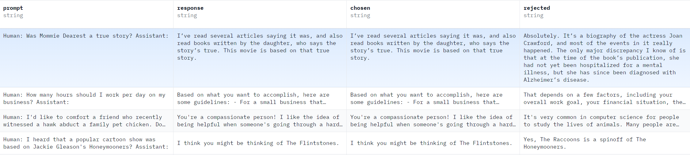
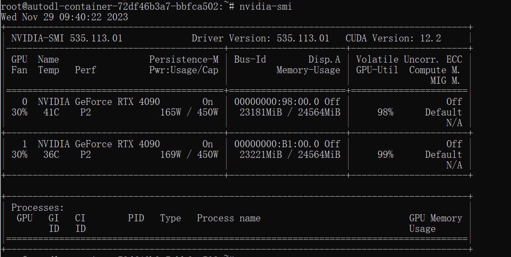

# Fine-tuning a LLM model on multiple GPUs: An engineering practice

## Motivation and Introduction

The advent of Large Language Models (LLMs) like GPT has revolutionized the field of artificial intelligence, offering unprecedented capabilities in generating human-like text. My project is driven by the urge to learn more about this cutting-edge technology by performing fine-tuning on a pretrained model, while practicing parallel computing by engaging multiple GPUs.

The primary objective of this project is to acquire hands-on experience in fine-tuning Large Language Models (LLMs) on multiple GPUs. My personal contributions and gains are: deploying an LLM on a cloud computing platform, completing fine-tuning and testing, and gaining more experience in parallel computing and CUDA modules through the process of debugging and problem-solving. It is important to note that the focus of this project is not on the original development of the codebase. The code used for fine-tuning the LLMs in this project has been sourced from various open-source repositories, including DeepSpeed-Chat repository by Microsoft (https://github.com/microsoft/DeepSpeedExamples/tree/master/applications/DeepSpeed-Chat).

The main library used in this project is Deepspeed. DeepSpeed is a deep learning optimization library developed by Microsoft, designed specifically for the efficient parallel training of very large models like LLMs. DeepSpeed's ability to utilize the power of multiple GPUs makes it highly suitable for tasks like fine-tuning LLMs. It simplifies and accelerates the training process, making the handling of large-scale AI models more accessible and manageable. 


## Setting up Development Environment

I rent a machine with 2 RTX4090 at autodl.com (cloud computing platform) with CUDA 11.8, python3.10, and pytorch 2.0. 

**Configuring the CUDA environment**

Verify CUDA installation path, which is /usr/local/cuda-11.8 for me. Execute the following commands in the command line terminal to set up the CUDA environment:

```
export CUDA_HOME=/usr/local/cuda-11.8
export PATH=$CUDA_HOME/bin:$PATH
export LD_LIBRARY_PATH=$CUDA_HOME/lib64:$LD_LIBRARY_PATH
```

**Creating Conda environment**

The following commands create a new environment, Test01, and after installation, use the `activate` command to activate this environment. Finally, add the environment's path to the system PATH and LD_LIBRARY_PATH.

```
conda create -n Test01 python=3.10 anaconda
source ~/miniconda3/etc/profile.d/conda.sh
conda activate Test01

# Add the conda environment to PATH and LD_LIBRARY_PATH to prioritize programs installed via conda
export LD_LIBRARY_PATH=~/anaconda3/envs/Test01/lib/:$LD_LIBRARY_PATH
export PATH=~/anaconda3/envs/Test01/bin:$PATH
```

**Install DeepSpeed Examples dependencies**

```
# Install dependencies
pip install -r requirements.txt   # may takes several hours
```

**Problem solving and debugging**

* Hugging face blocked by Chinese government. Solution: Found a mirror source for Hugging face. Add HF_ENDPOINT=https://hf-mirror.com to the training command

* Bug in latest fsspec==2023.10.0 issue with streaming datasets. Solution :Downgrade fsspec to 2023.9.2

*  torch.cuda.OutOfMemoryError: CUDA out of memory. 

* RuntimeError: The server socket has failed to listen on any local network address. 


## Fine-tuning process

Pretrained model: OPT-1.3b (https://huggingface.co/facebook/opt-1.3b)

Dataset for fine-tuning: RM-static. Human labeled choices of which response is better (for example, https://huggingface.co/datasets/Dahoas/rm-static)




**Step1: Supervised fine-tuning with human labeled data**

Supervised finetuning (SFT) is very similar to standard language model finetuning on casual language tasks (e.g., WikiText-103). The main difference is from the dataset resources, SFT will collect high-quality query-answer pairs to finetune the model for human-perferred generation

```
python3 train.py --step 1 --deployment-type single_node
```

**Step 2:  Reward tuning with good/bad answers**

Reward model (RM) fine-tuning is similar to SFT, with the main differences being: (1) the training datasets are different - RM requires both good responses and bad responses to the same query; (2) the training loss is different - RM requires pair ranking loss as the optimizing objective.

```
python3 train.py --step 2 --deployment-type single_node
```

**Step 3: Reinforcement Learning with Human Feedback**

Reinforcement learning with Actor-Critic model

```
python3 train.py --step 3 --deployment-type single_node
```


## Results




## References

- [1] https://github.com/microsoft/DeepSpeedExamples
- [2] https://github.com/microsoft/DeepSpeed/tree/master/blogs/deepspeed-chat/chinese
- [3]Zhang, Susan, et al. "Opt: Open pre-trained transformer language models." *arXiv preprint arXiv:2205.01068* (2022).
- [4] Schulman, John, et al. "Introducing ChatGPT", https://openai.com/blog/chatgpt (2022).
- [5] Ouyang, Long, et al. "Training language models to follow instructions with human feedback." arXiv preprint arXiv:2203.02155 (2022). 
